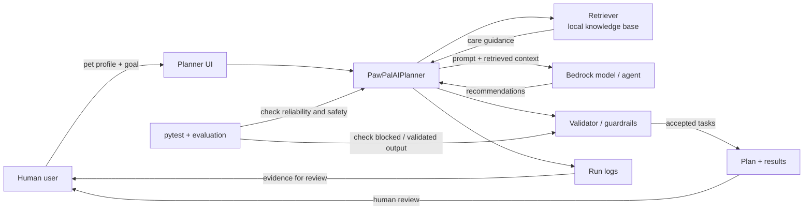
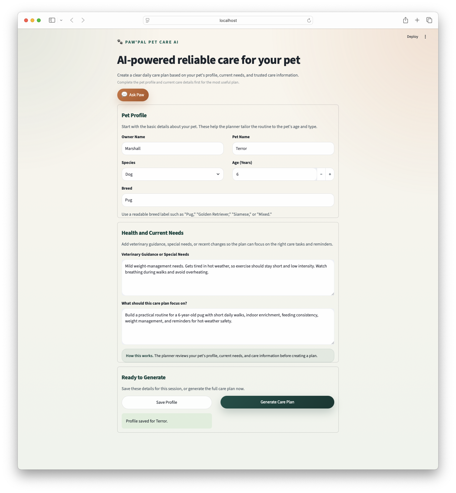
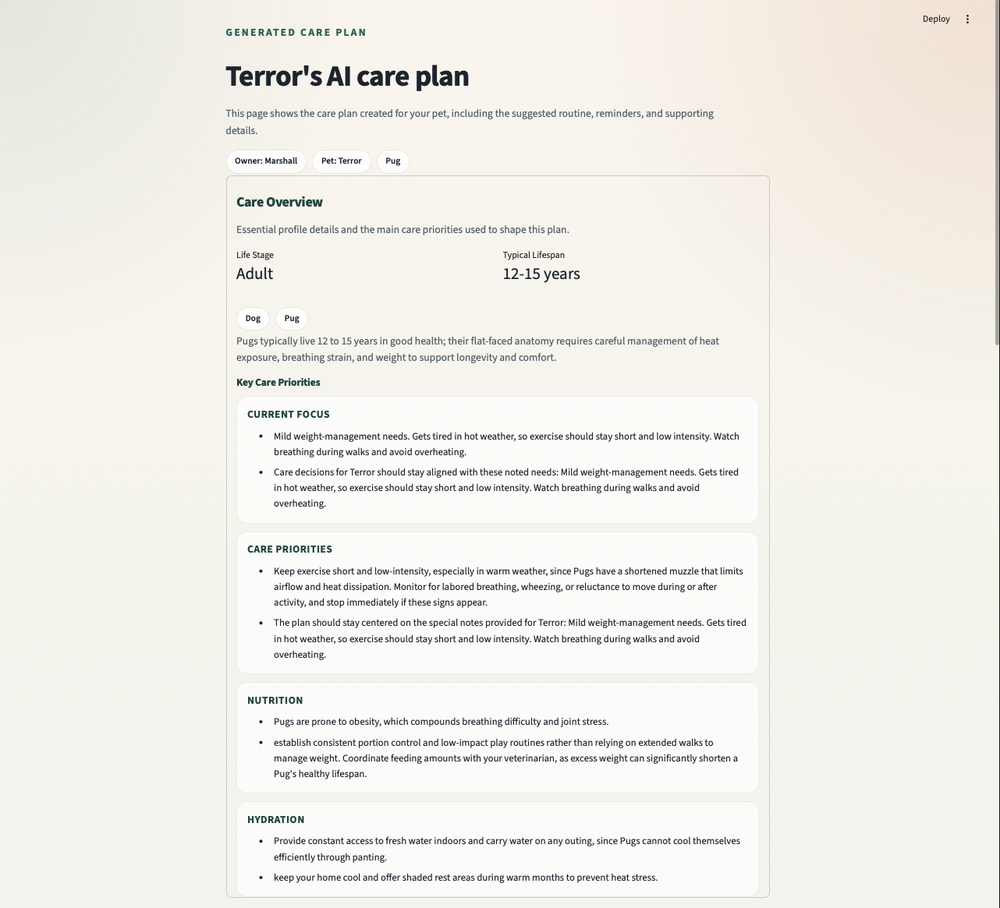
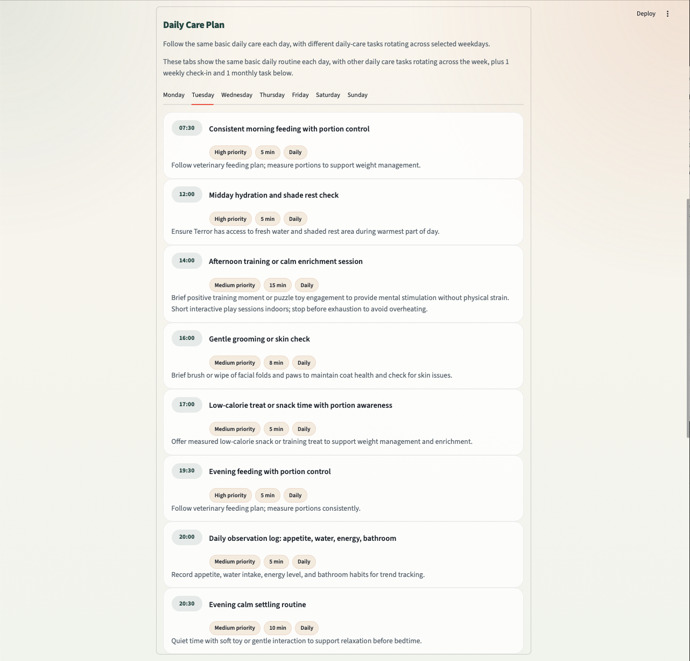
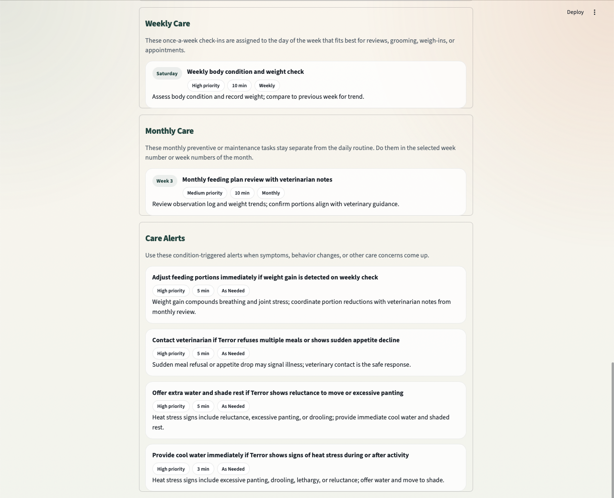
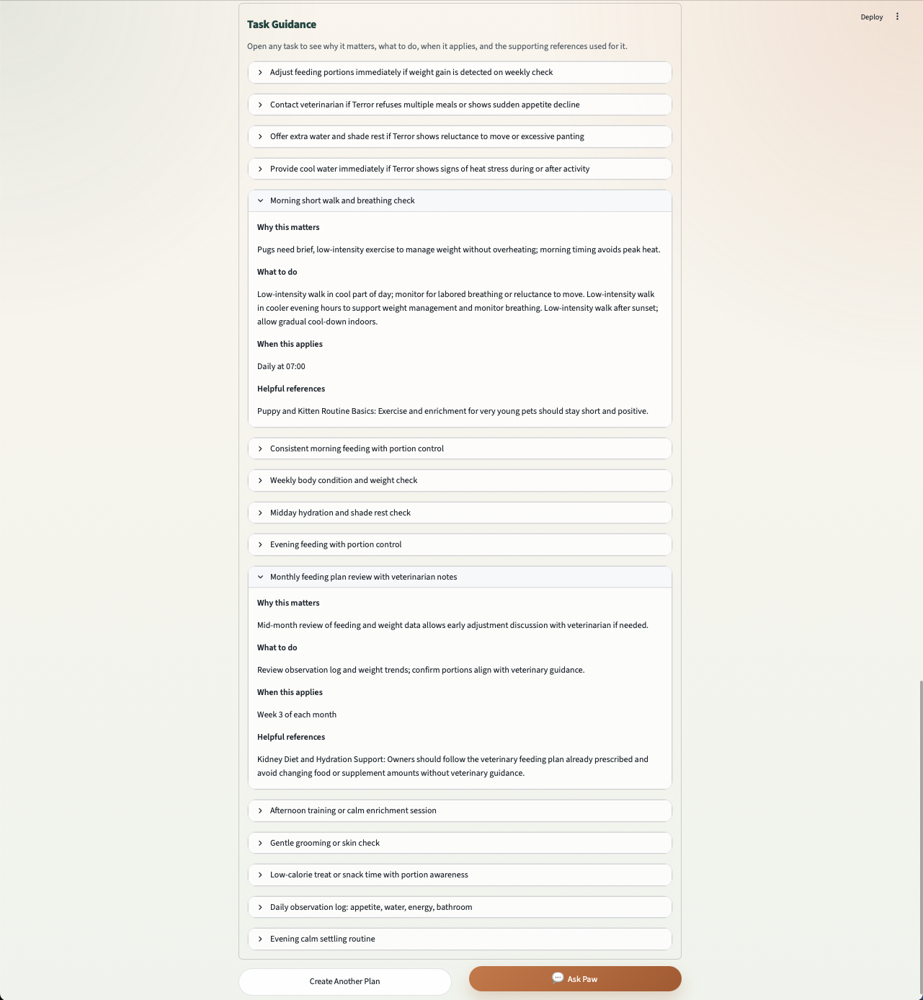
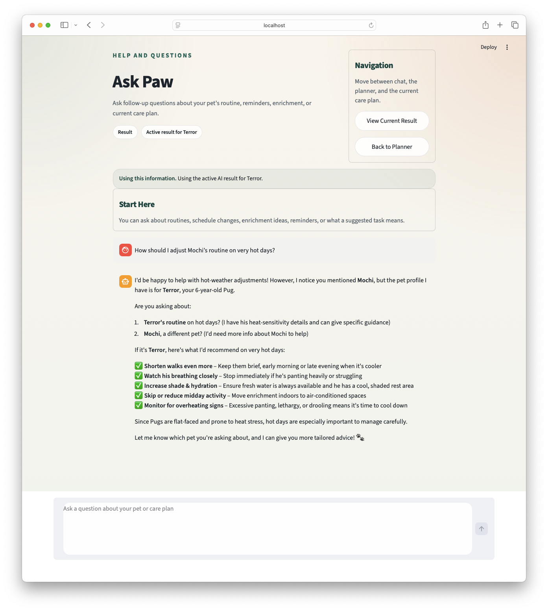

# PawPal+ Pet Care AI

PawPal+ Pet Care AI started as a pet-care scheduling project and evolved into an applied AI system for building grounded, explainable care plans. The original goal was to help pet owners organize routines more clearly; the final system now generates profile-aware plans, explains why tasks were suggested, and supports safe follow-up questions through chat. I built it to show that useful AI products are not just model calls, but systems that combine retrieval, validation, logging, and testing.

## Project Summary

PawPal+ helps a pet owner turn a pet profile, care notes, and a current goal into a structured care plan with daily, weekly, monthly, and condition-based guidance. The app matters because many owners know their pets need consistency, but it is difficult to translate age, breed, special needs, and real-life constraints into a practical routine without either overcomplicating the plan or relying on generic advice.

This project demonstrates:

- profile-driven AI planning
- retrieval-augmented generation over curated care documents
- deterministic guardrails for safer output
- contextual follow-up chat tied to the active pet and plan
- logging and evaluation for reliability

## Why This Project Matters

I wanted this project to feel like a real applied AI system rather than a simple chatbot demo. PawPal+ uses AI where reasoning is helpful, but it keeps deterministic code in control of safety, structure, and explainability. That balance made the project much stronger both technically and as a portfolio artifact.

## Architecture Overview



At a high level, the user enters a pet profile and care goal in the planner UI. `PawPalAIPlanner` orchestrates retrieval from a local knowledge base, sends grounded context to Amazon Bedrock, validates the returned recommendations, and turns accepted tasks into a final care plan. The system also records run logs for traceability, while `pytest` and the evaluation harness check that the planner and validator behave reliably and safely.

### Core Components

- `planner.py`: collects profile details, current care notes, and generation goals
- `pawpal_ai.py`: orchestrates retrieval, model calls, validation, scheduling, and logging
- `ai_retrieval.py`: retrieves relevant passages from the local `knowledge_base/`
- `bedrock_client.py`: wraps Amazon Bedrock for species profiling, plan generation, and chat
- `ai_validation.py`: blocks unsafe, malformed, or unsupported recommendations
- `pages/Results.py`: presents the generated plan, rationale, reminders, and references
- `pages/Chat.py`: handles follow-up Q&A using the current profile or active result
- `evaluate_ai_system.py`: runs scenario-based reliability checks

## Screenshots / Demo Walkthrough

### 1. Planner Input



This is the profile-entry stage of the app. In this demo, I used a 6-year-old pug with mild weight-management needs and hot-weather sensitivity so the generated plan would need both routine care and heat-safety guidance.

### 2. Care Overview



The generated result starts with a synthesized care overview, including life-stage context, lifespan guidance, and high-level care priorities. This shows that the system is not only outputting tasks, but also building a readable explanation of why the plan looks the way it does.

### 3. Daily Care Plan



The daily plan turns the profile into concrete tasks with times, durations, priorities, and concise rationales. In this example, the plan includes feeding consistency, hydration and shade checks, gentle enrichment, grooming, and observation logging.

### 4. Weekly, Monthly, and Condition-Based Guidance



PawPal+ separates recurring care by cadence. This screen shows weekly check-ins, monthly review tasks, and “as needed” care alerts that trigger when symptoms or risk conditions show up.

### 5. Task Guidance and Supporting References



Each task can be expanded to show why it matters, what to do, when it applies, and the supporting reference used to justify it. This explainability layer was important because I wanted the system to be inspectable, not a black box.

### 6. Contextual Follow-Up Chat



The chat assistant uses the active plan context. In this screenshot, I intentionally asked about “Mochi” even though the active profile was for `Terror`, and the assistant correctly noticed the mismatch, asked for clarification, and still provided practical hot-weather guidance for the current pet profile. That behavior is a good example of contextual reasoning instead of blindly answering.

## Setup Instructions

### 1. Create a virtual environment

```bash
python -m venv .venv
source .venv/bin/activate
```

### 2. Install dependencies

```bash
pip install -r requirements.txt
```

### 3. Configure AWS credentials

PawPal+ uses Amazon Bedrock for species profiling, plan generation, and follow-up chat. The easiest local setup is:

```bash
aws configure
```

### 4. Set environment variables

At minimum, set the Bedrock region:

```bash
export AWS_REGION="us-west-2"
```

Optional overrides:

```bash
export AWS_PROFILE="default"
export BEDROCK_MODEL_ID="global.anthropic.claude-haiku-4-5-20251001-v1:0"
```

## How to Run

### Run the app

```bash
streamlit run app.py
```

### Run the test suite

```bash
pytest -q
```

### Run the evaluation harness

```bash
python evaluate_ai_system.py
```

The evaluation script runs multiple realistic scenarios and reports groundedness, cadence compliance, blocked-output behavior, plan-shape validity, and consistency across repeated runs.

## Sample Interactions

### Example 1: 6-year-old pug care plan

**Input**

- Species: Dog
- Breed: Pug
- Age: 6
- Special needs: mild weight-management needs, tires in hot weather, monitor breathing on walks
- Goal: create a practical routine with short daily walks, indoor enrichment, feeding consistency, and hot-weather safety

**Result**

- daily feeding and hydration checks
- calm enrichment and short training sessions
- gentle grooming / skin checks
- observation logging for appetite, water, energy, and bathroom habits
- weekly weight review
- monthly feeding-plan review
- hot-weather care alerts for panting, reluctance to move, and overheating

### Example 2: Condition-based safety guidance

**Input**

- Same pug profile
- Focus on hot-weather safety and breathing concerns

**Result**

- “Offer extra water and shade rest if Terror shows reluctance to move or excessive panting”
- “Provide cool water immediately if Terror shows signs of heat stress during or after activity”
- “Contact veterinarian if Terror refuses multiple meals or shows sudden appetite decline”

This example shows that the system can mix routine planning with condition-triggered guidance instead of producing only static tasks.

### Example 3: Context-aware follow-up chat

**Input**

`How should I adjust Mochi’s routine on very hot days?`

**Result**

- the assistant notices that the active profile is `Terror`, not `Mochi`
- it asks whether the user means Terror or a different pet
- it still gives concrete hot-weather guidance for the active pug profile:
  - shorten walks further
  - watch breathing closely
  - increase shade and hydration
  - reduce midday activity
  - monitor for overheating signs

## Design Decisions and Trade-Offs

### Why I built it this way

I wanted PawPal+ to feel trustworthy and inspectable, not just impressive for one prompt. That led me to build the system around retrieval, validation, logging, and testing rather than letting the model directly control the final output.

The most important design choices were:

- **Local retrieval over curated documents**
  I used a small local knowledge base so the reasoning path would be reproducible and easy to explain.
- **Deterministic validation before display**
  The validator checks sources, cadence, durations, times, and unsafe medical-style advice before recommendations become visible tasks.
- **Multipage UI**
  I split the app into planner, results, and chat pages so the workflow is easier to understand and demo.
- **Preserving the deterministic backbone**
  The original scheduling/domain model still matters. AI suggests tasks, but deterministic code still controls structure and safety.
- **Logging and evaluation**
  I wanted each AI run to be traceable and testable, not just visually convincing.

### Trade-offs

- **Lexical retrieval vs embeddings**
  The current retrieval approach is simpler and easier to reproduce, but less sophisticated than embedding-based retrieval.
- **Strict guardrails vs flexibility**
  Strong validation reduces model freedom, but improves trustworthiness and keeps the app from sounding like a diagnostic tool.
- **Bedrock integration vs portability**
  Bedrock gave me strong model capability, but it also means the app depends on AWS credentials and model access.
- **Session-based UI vs persistence**
  Streamlit session state keeps the demo simple, but results and chat history are not persisted across refreshes.

## Phase 4: Reliability and Evaluation

I wanted the AI in this project to prove it was working, not just look convincing in a demo. To do that, I combined automated tests, deterministic guardrails, run-level logging, confidence and reliability scoring, and manual review of outputs in the UI.

- **Automated tests**: the project currently has **102 passing tests** covering scheduler behavior, retrieval, Bedrock response parsing, validation, orchestration, and contextual chat behavior.
- **Confidence and reliability scoring**: validated recommendations keep a `confidence_score`, and each planning run stores an overall `reliability_score` so I can inspect how strong the accepted output was.
- **Logging and error handling**: each AI planning run is saved as a JSON trace with retrieved passages, raw recommendations, blocked recommendations, warnings, accepted tasks, and final schedule output.
- **Human evaluation**: I manually reviewed generated plans and chat responses to make sure they were grounded, readable, and safely constrained, and the screenshots in this README show those end-to-end results.
- **Scenario-based evaluation**: the evaluation script runs multiple predefined scenarios, including cadence-constrained and unsafe-input cases, to check groundedness, blocked-output behavior, plan shape, and consistency.

In short: **102 out of 102 automated tests passed.** The system also logs each AI planning run, assigns a reliability score to accepted outputs, and blocks unsafe or unsupported recommendations before they appear in the final plan. In manual review, the strongest outputs were grounded and readable, while the main weakness was lower-quality behavior when the available context was limited or overly constrained.

## Testing Summary

The current automated suite has **102 passing tests**.

### What I tested

- scheduler and domain-model behavior
- retrieval relevance
- Bedrock response parsing and malformed-output recovery
- validator and guardrail behavior
- orchestration of species profiling, retrieval, planning, and task replacement
- contextual chat behavior and safe fallback behavior

### What worked well

- The deterministic validation layer made the AI behavior much safer and easier to reason about.
- Unit coverage made it easier to refactor prompts, planning flow, and UI behavior without losing confidence.
- The scenario-based evaluation harness helped test the system beyond one successful demo run.

### What still has limits

- Live evaluation depends on valid AWS credentials, Bedrock access, and network availability.
- The retrieval layer is still local and lexical.
- The UI is still session-based and optimized for demo flow rather than persistence.

### What I learned from testing

One of the biggest lessons from this project was that AI systems need more than one good-looking output. They need validation, repeatability, logging, and scenario-based checks so you can trust them beyond a single demo.
