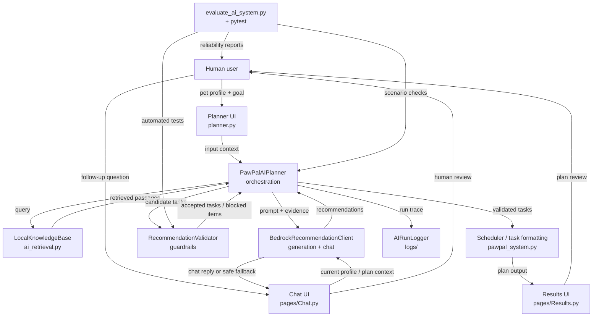

# PawPal+ Pet Care AI

PawPal+ is now a profile-driven Pet Care AI rather than a manual task scheduler.

The upgraded app uses:

- `Amazon Bedrock` for structured Claude task recommendations
- `Amazon Bedrock` for contextual follow-up chat and species profiling
- `local retrieval` over curated pet-care documents for grounding
- `deterministic guardrails` to block unsupported or unsafe advice
- recurring routine generation for `daily`, `weekly`, `monthly`, and condition-based care
- a derived daily schedule and in-app reminder view
- a dedicated `Chat with PawPal AI` page for follow-up questions
- `logging + evaluation` to make system behavior traceable and testable

## Problem

Pet owners often know their pet needs structure, but struggle to translate age, breed/species traits, special needs, and changing situations into a realistic care routine. PawPal+ helps by generating grounded daily, weekly, and monthly care tasks, surfacing reminders, and explaining why the plan makes sense for that pet.

This makes the app useful for:

- senior pets needing low-impact routines
- pets on special diets or medication reminders
- owners who want condition-aware routines without manually building task lists
- users who want explanations for why tasks were recommended

## System Flow

The main planning pipeline is:

`pet profile + breed/custom species context + inferred traits + age context -> retrieve local care guidance -> Claude recommends recurring care tasks -> validator blocks unsafe or ungrounded advice -> app groups routines into daily/weekly/monthly sections -> app shows reminders, rationale, warnings, and logs`

The follow-up chat pipeline is:

`current pet/profile context or active AI result -> Bedrock chat reply -> medical-safety fallback if needed`

### Components

- `app.py`
  Streamlit entrypoint that registers hidden navigation across planner, results, and chat.

- `planner.py`
  Main planner page for pet profile setup, AI care-plan generation, and result handoff.

- `pages/Results.py`
  Dedicated results page for the generated plan, reminders, evidence, and the AI-derived pet profile.

- `pages/Chat.py`
  Dedicated chat page for follow-up questions about the pet, the plan, or broader pet-care concerns.

- `pawpal_system.py`
  Core deterministic domain model and scheduler. This remains the planning backbone.

- `ai_retrieval.py`
  Local retrieval layer over the repo's curated knowledge base in `knowledge_base/`.

- `bedrock_client.py`
  Amazon Bedrock Converse wrapper that handles species profiling, structured plan generation, and free-form chat.

- `ai_validation.py`
  Guardrails for groundedness, schema checks, time validation, and unsafe-advice blocking.

- `pawpal_ai.py`
  Orchestration layer that ties retrieval, Claude, validation, logging, and scheduling together.

- `pawpal_chat.py`
  Chat orchestration layer that builds conversation context from the current profile or active AI result.

- `ai_logging.py`
  Writes per-run JSON traces to `logs/`.

- `evaluate_ai_system.py`
  Structured experiment runner for repeatable reliability checks across multiple scenarios.

## Short System Diagram

### Mermaid



### ASCII

```text
Human
  -> Planner UI
  -> PawPalAIPlanner
  -> Retriever (local knowledge base)
  -> Bedrock model
  -> Validator / guardrails
  -> Scheduler / plan formatter
  -> Results UI
  -> Human review

Human
  -> Chat UI
  -> Bedrock chat with current profile/plan context
  -> reply or safe fallback
  -> Human review

Testing / checking
  -> RecommendationValidator blocks unsafe or unsupported outputs before display
  -> evaluate_ai_system.py runs scenario-based reliability checks
  -> pytest covers retrieval, validation, orchestration, and chat behavior
```

### Image Spec

If this is turned into a visual slide or report diagram, use seven boxes arranged left-to-right or top-to-bottom:

`Human / UI` -> `AI Orchestration` -> `Retriever` -> `Model` -> `Validation` -> `Scheduler / Output` -> `Logging`

Then add:

- a side box for `Evaluation / Tests`
- an arrow from `Evaluation / Tests` into the orchestration / validation area
- an arrow from `Results UI` back to `Human review`
- a smaller parallel chat lane showing `Human -> Chat UI -> Model -> safe reply/fallback -> Human`

This should emphasize `input -> process -> output`, plus the fact that both deterministic checks and human review are used to inspect AI behavior.

## Trust and Safety Design

PawPal+ is designed to be explainable and constrained instead of acting like an unrestricted chatbot.

- The model receives retrieved care guidance and is instructed to stay inside that evidence.
- Recommendations must include source IDs, rationale, time, priority, and frequency.
- The chat assistant can answer broader questions, but it still refuses diagnosis, dosage changes, prescription advice, and replacing veterinary care.
- The validator blocks:
  unsupported source citations,
  malformed times,
  invalid priorities or durations,
  diagnosis-like claims,
  medication dosage changes,
  advice that tries to replace veterinary care.
- The app logs retrieved passages, raw recommendations, blocked items, accepted tasks, and the final schedule plan.

This means Claude can help reason, but deterministic code still decides what is acceptable.

## Knowledge Base

The local retrieval set currently includes:

- `puppy_kitten_routine.md`
- `senior_pet_support.md`
- `kidney_diet_care.md`
- `medication_and_safety.md`
- `enrichment_and_monitoring.md`

These documents are intentionally local and curated so the demo is reproducible and the reasoning path is easy to explain.

## Setup

```bash
python -m venv .venv
source .venv/bin/activate
pip install -r requirements.txt
```

Configure AWS credentials before using the AI features. The recommended local workflow is AWS CLI or an existing named profile:

```bash
aws configure
```

Set the Bedrock region. Optional overrides are shown below:

```bash
export AWS_REGION="us-west-2"
export AWS_PROFILE="default"
export BEDROCK_MODEL_ID="global.anthropic.claude-haiku-4-5-20251001-v1:0"
```

PawPal+ reads these values from your AWS environment or credential chain automatically. The app does not ask for AWS secret keys directly and does not expose Bedrock configuration fields in the UI.

## Run the App

```bash
streamlit run app.py
```

Navigation is fully button-driven inside the app body. PawPal+ does not use a visible Streamlit sidebar for page navigation.

### Recommended demo flow

1. Create a pet profile with species, optional breed for dogs/cats, custom species for `Other`, age, and special-needs guidance.
2. Add an optional current situation or concern.
3. Click `Generate Pet Care Plan`.
4. Review the dedicated results page with the AI-derived pet profile, daily schedule, weekly care, monthly care, condition-based guidance, reminders, blocked items, and evidence.
5. Open `Chat with PawPal AI` for follow-up questions tied to the current profile or active result.

## Reliability Evaluation

Run the unit tests:

```bash
python -m pytest -q
```

Run the live evaluation harness:

```bash
python evaluate_ai_system.py
```

The evaluation script runs multiple realistic scenarios, repeats them, and reports:

- average reliability score
- groundedness pass/fail
- blocked-output expectation pass/fail
- cadence compliance
- plan-shape validity
- consistency across repeated runs
- blocked recommendation counts
- accepted task summaries

It also saves a JSON report into `logs/`.

## Current Automated Coverage

The repo includes tests for:

- existing scheduler behavior
- retrieval relevance
- validator blocking of unsafe or ungrounded recommendations
- AI orchestration with a fake Bedrock client
- replacement of stale AI tasks while preserving manual tasks
- pet age-context reasoning, breed/custom-species validation, and inferred traits
- contextual chat behavior and unsafe chat fallback

Current test status:

- `69 passing tests`

## Public Interface Changes

`Task` now supports additional AI-related metadata:

- `ai_generated`
- `rationale`
- `confidence_score`
- `source_ids`
- `validation_status`

These fields support explainability in the generated plan, logs, and evaluation outputs.

## Limitations

- The retrieval layer is lexical and local, not embedding-based.
- The app is a planning assistant, not a medical diagnosis tool.
- Live evaluation requires valid AWS credentials, Bedrock model access, and network access.
- The current UI focuses on one active pet profile in Streamlit, even though the scheduler model still supports multiple pets.
- Generated results and chat history are session-based in the UI rather than persisted across refreshes.
- The fixed default model is `global.anthropic.claude-haiku-4-5-20251001-v1:0`; if your account or region does not have access, choose another Bedrock Claude model ID you are enabled for.

## Architecture Summary

PawPal+ now demonstrates four applied-AI ideas in one system:

- `RAG`
  recommendations are grounded in retrieved pet-care documents

- `Reasoning`
  Claude converts pet context and evidence into structured task proposals

- `Guardrails`
  deterministic validators block unsafe or unsupported output

- `Reliability testing`
  unit tests, run logs, and scenario-based evaluation make the system inspectable
